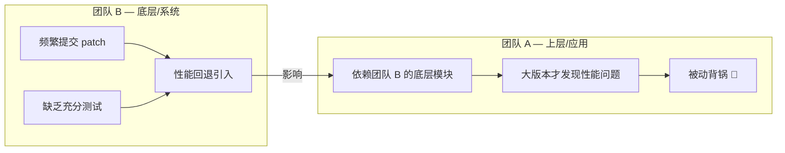
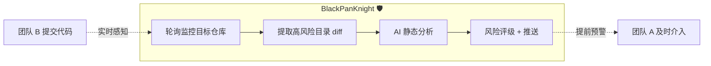
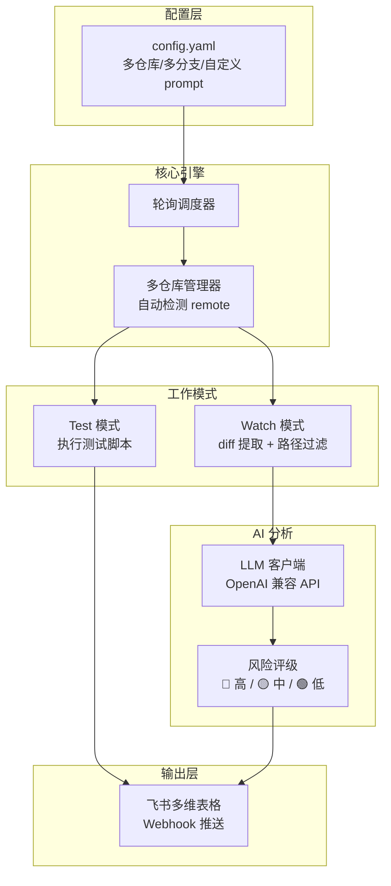

# BlackPanKnight / 黑锅侠 🛡️

基于 Git 仓库监控 + AI 静态分析的跨团队代码变更风险预警工具。

## 痛点



在多团队协作的大型项目中，模块间存在复杂的依赖关系。常见问题：

- 上游模块频繁合入 patch，缺乏充分的性能回归验证
- 性能问题在大版本集成阶段才暴露，定位成本极高
- 下游模块被动承受性能回退，缺乏提前感知手段
- 自动化性能监控体系建设周期长，人工 review 覆盖不全

## 解决思路

**在代码合入阶段就感知风险，而非等到集成测试才发现问题。**



BlackPanKnight 提供两种工作模式：

| 模式 | 用途 | 流程 |
|------|------|------|
| **test** | 回归测试 | 监控变更 → 执行测试脚本 → 报告通过/失败 |
| **watch** | 风险预警 | 监控变更 → 路径过滤 → AI 分析 → 推送风险报告 |

## 与传统方案对比

| 维度 | 传统 CI/CD | 人工 Code Review | BlackPanKnight |
|------|-----------|-----------------|----------------|
| 覆盖范围 | 仅自己仓库 | 依赖 reviewer 精力 | 跨团队、多仓库、多分支 |
| 性能关注 | 需要专门测试环境 | 容易遗漏性能问题 | AI 专注性能维度分析 |
| 响应速度 | 需要编译+部署+跑测试 | 异步，延迟大 | 分钟级，无需编译 |
| 部署成本 | 需要设备/服务器 | 人力成本 | 本地开发机即可运行 |
| 可定制性 | 固定流水线 | 因人而异 | YAML 配置 prompt + 监控路径 |

## 系统架构



## 快速开始

```bash
# 安装依赖
pip install -r requirements.txt

# 复制配置模板并编辑
cp config.example.yaml config.yaml

# 全链路测试
python main.py --test-all

# 单项测试
python main.py --test-repos      # 仓库路径 + 分支 + sync
python main.py --test-webhook    # 飞书多维表格推送
python main.py --test-llm        # LLM 分析能力

# 运行一次（调试）
python main.py --once

# 持续监控
python main.py
```

## 配置示例

```yaml
global:
  llm_base_url: "http://your-llm-server/v1/"
  llm_api_key: "your-key"
  llm_model: "gpt-4o"
  webhook_url: "https://open.feishu.cn/base/webhook/xxx"
  sync_command: "git fetch origin"
  poll_interval_minutes: 15
  ai_prompt: |
    你是一个性能分析专家，请分析以下代码变更...

repos:
  - name: "底层平台"
    path: "/path/to/repo"
    branches: ["main", "dev"]
    mode: watch
    watch_paths:
      - "src/core/"
      - "drivers/"
      - "include/*.h"
    ai_analysis: true
```

## 开发

```bash
# 安装开发依赖
pip install -r requirements-dev.txt

# 运行测试
bash run_tests.sh

# 格式化代码
bash format.sh

# 格式检查 + lint
bash format.sh --check --lint
```

## License

[MIT](./LICENSE)
