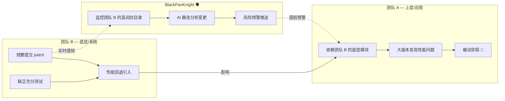
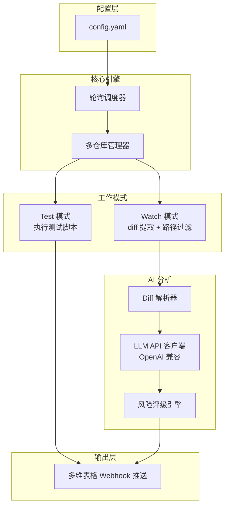
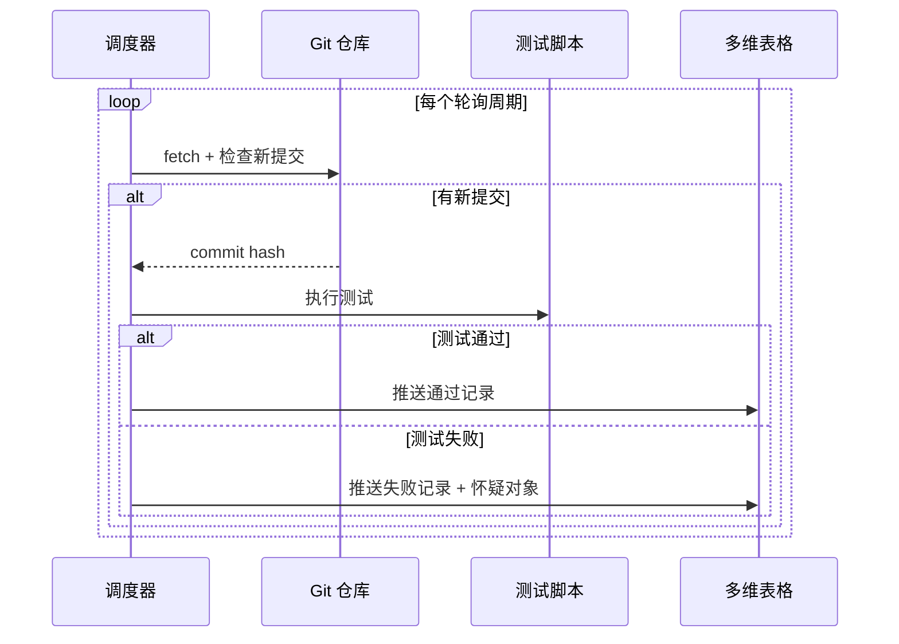
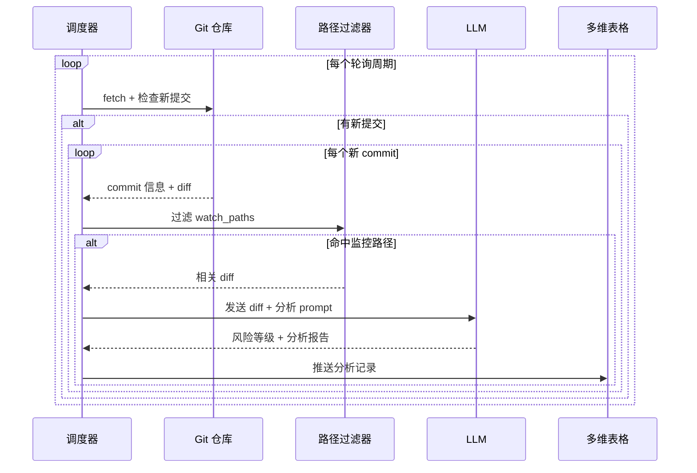

# BlackPanKnight v2 设计文档

## 1. 项目定位

BlackPanKnight（黑锅侠）是一个面向嵌入式/系统开发团队的 Git 仓库监控工具，核心能力：

- **模式 A（test）**：监控仓库变更 → 执行测试 → 推送结果到飞书多维表格
- **模式 B（watch）**：监控指定目录/文件变更 → 提取 diff → AI 静态分析 → 风险评级 → 推送到飞书多维表格

### 问题背景



目标：团队 A 通过 BlackPanKnight 实时感知团队 B 的高风险变更，将问题拦截在合入阶段，而非被动等到大版本集成时才发现性能回退。

## 2. 系统架构



## 3. 工作流程

### 3.1 Test 模式



### 3.2 Watch 模式



## 4. 配置文件设计

```yaml
# config.yaml
global:
  llm_base_url: "http://your-llm-server/v1/"   # OpenAI 兼容 API 地址
  llm_api_key: "your-api-key-here"
  llm_model: "gpt-4o"                           # 任意 OpenAI 兼容模型
  poll_interval_minutes: 30                      # 全局默认轮询间隔

repos:
  # ===== 模式 A: 测试模式 =====
  - name: "项目 Alpha 单元测试"
    path: "/home/user/repos/alpha"
    branches:
      - "main"
      - "dev"
    sync_command: "git fetch origin"
    mode: test
    test_script: "./run_tests.sh"
    webhook_url: "https://open.feishu.cn/base/webhook/xxx"
    poll_interval_minutes: 60            # 可覆盖全局间隔

  # ===== 模式 B: 监控模式 =====
  - name: "团队 B 底层仓库"
    path: "/home/user/repos/platform"
    branches:
      - "dev/main"
      - "feature/scheduler"
    sync_command: "git fetch origin"
    mode: watch
    watch_paths:                          # 重点监控的目录/文件
      - "src/core/"
      - "src/drivers/"
      - "include/*.h"
      - "configs/"
    webhook_url: "https://open.feishu.cn/base/webhook/yyy"
    ai_analysis: true
    poll_interval_minutes: 15            # 高风险区域，盯紧一点
```

## 5. 多维表格 Webhook 推送格式

### 5.1 Test 模式推送字段

| 字段名 | 类型 | 示例 |
|--------|------|------|
| 仓库 | 文本 | 项目 Alpha 单元测试 |
| 分支 | 文本 | main |
| 状态 | 文本 | ✅ 通过 / ❌ 失败 |
| 提交者 | 文本 | zhangsan |
| Commit | 文本 | abc1234f |
| 提交信息 | 文本 | fix: memory leak in lv_obj |
| 怀疑对象 | 文本 | (失败时) commit 范围列表 |
| 时间 | 文本 | 2026-05-12 16:30 |

### 5.2 Watch 模式推送字段

| 字段名 | 类型 | 示例 |
|--------|------|------|
| 仓库 | 文本 | 团队 B 底层仓库 |
| 分支 | 文本 | dev/system |
| 提交者 | 文本 | lisi |
| Commit | 文本 | def5678a |
| 提交信息 | 文本 | perf: optimize context switch |
| 变更文件 | 文本 | kernel/sched/core.c, ... |
| 变更统计 | 文本 | +120/-30 |
| AI 风险等级 | 文本 | 🔴 高风险 |
| AI 分析 | 文本 | 修改了调度器热路径... |
| 时间 | 文本 | 2026-05-12 16:30 |

## 6. AI 分析 Prompt 设计

```text
你是一个嵌入式系统性能分析专家。请分析以下 Git commit 的代码变更，
重点关注对系统性能的潜在影响。

关注维度：
1. 是否修改了热路径（高频调用的函数）
2. 是否引入/修改了锁、同步原语、原子操作
3. 内存分配模式是否变化（栈→堆、新增动态分配）
4. 算法复杂度是否变化
5. 是否影响 GPU/显示相关的调度或资源管理
6. 是否有明显的性能反模式（循环内分配、不必要的拷贝等）

请输出：
- 风险等级：🔴 高风险 / 🟡 中风险 / 🟢 低风险
- 分析摘要：一段话概括主要风险点（100字以内）
- 详细分析：逐文件分析变更影响

---
Commit: {commit_hash}
Author: {author}
Message: {commit_message}

Diff:
{diff_content}
```

## 7. 项目结构

```
BlackPanKnight/
├── config.yaml              # 用户配置文件
├── main.py                  # 新版入口
├── main_legacy.py           # 旧版保留
├── docs/
│   └── design.md            # 本文档
└── src/
    ├── __init__.py
    ├── config.py            # 配置加载与校验
    ├── scheduler.py         # 轮询调度器
    ├── repo.py              # Git 仓库操作封装
    ├── modes/
    │   ├── __init__.py
    │   ├── test_mode.py     # Test 模式逻辑
    │   └── watch_mode.py    # Watch 模式逻辑
    ├── ai/
    │   ├── __init__.py
    │   ├── client.py        # LLM API 客户端 (OpenAI 兼容)
    │   └── prompts.py       # Prompt 模板管理
    └── notify/
        ├── __init__.py
        └── webhook.py       # 多维表格 Webhook 推送
```

## 8. 技术选型

| 组件 | 选择 | 理由 |
|------|------|------|
| 语言 | Python 3.10+ | 现有代码基础，生态丰富 |
| AI SDK | openai (Python) | 兼容任意 OpenAI API 服务 |
| 配置 | PyYAML | 人类可读，支持复杂嵌套 |
| HTTP | requests | 轻量，现有依赖 |
| Git 操作 | subprocess + git CLI | 简单直接，无额外依赖 |
| 日志 | logging (stdlib) | 够用，无需引入额外框架 |

## 9. 开发计划

### Phase 1（当前）
- [x] 设计文档
- [ ] 配置文件解析
- [ ] 多仓库多分支调度器
- [ ] Watch 模式：diff 提取 + 路径过滤
- [ ] LLM API 客户端接入
- [ ] 多维表格 Webhook 推送（新格式）
- [ ] Test 模式迁移（兼容旧功能）

### Phase 2（后续）
- [ ] AI 风险评级分级通知
- [ ] Web UI 仪表盘
- [ ] 设备测试环境集成
- [ ] 性能基线对比

## 10. 运行方式

```bash
# 使用配置文件启动
python main.py --config config.yaml

# 也可以指定单个仓库快速测试
python main.py --config config.yaml --repo "项目 Alpha 单元测试"
```
